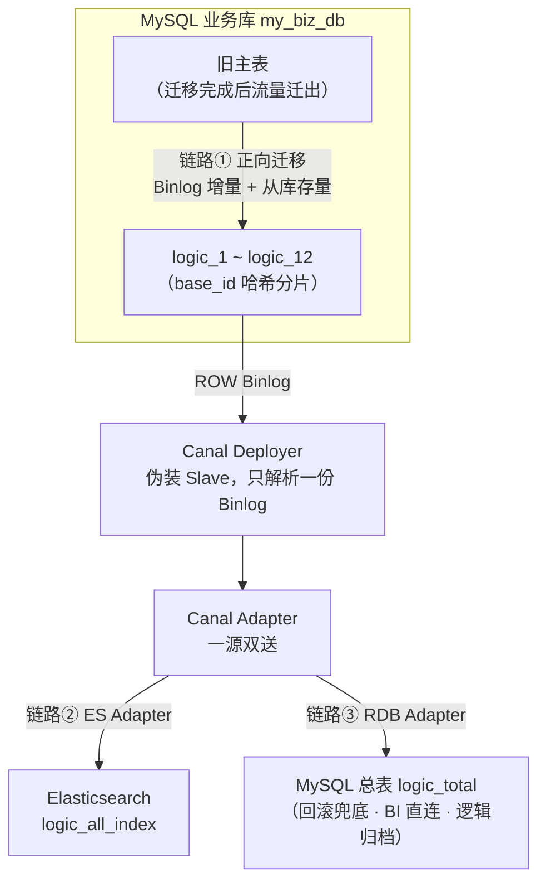
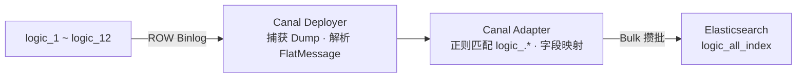
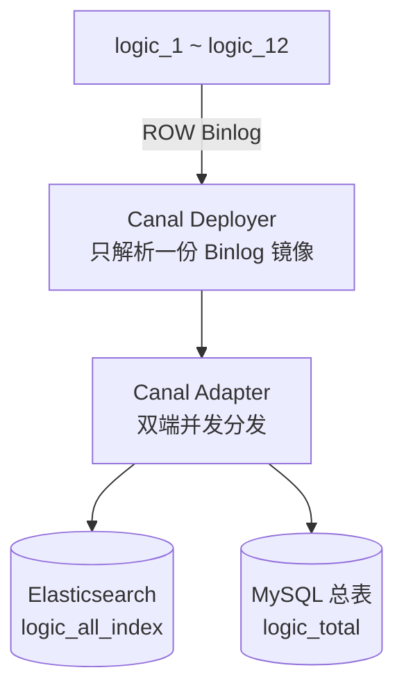

## 引言

单表数据量突破千万乃至亿级之后，读写性能与扩展性问题会躲不开。最近完成了一次业务表分表实践：主表按 `base_id` 哈希拆分为 12 张物理分表 `logic_1` ~ `logic_12`，每条记录带一个 `varchar` 类型的业务索引属性 `f_key`。文中表名与字段已脱敏。

拆表本身只是开始。要让系统在拆分期间和拆分之后都正常运转，需要三条数据链路配合：

1. **主表 → 分表**：存量 + 增量平滑迁移，业务不停机、数据不丢失、过程可回滚；
2. **分表 → Elasticsearch**：12 张分表汇聚到同一个 ES 索引，承接前端多维组合查询与统计展示；
3. **分表 → MySQL 总表**：实时反向回写，切流期间充当回滚兜底，稳定后供 BI 报表直连与逻辑归档。

三条链路都构建在同一套 CDC 底座上：Canal。这篇文章是完整的实践记录，包括选型依据、迁移五步法、双端同步配置落地、异构数据类型对齐，以及生产环境的踩坑清单。

整体架构先放在这里，后面逐条链路拆解：



链路①在迁移期运行，切流完成后停止；链路②③常驻，共用一份 Canal Deployer 解析出的 Binlog，在 Adapter 层双端分发。

---

## 一、技术选型：为什么是 Canal

数据同步领域最常见的两类方案：基于 SQL 轮询的拉模式（如 Logstash JDBC Input），与基于 Binlog 的推模式（如 Canal / Debezium）。逐项对比：

| 对比维度                    | Canal（Binlog CDC，推模式）                       | Logstash / SQL 轮询（拉模式）                         |
| --------------------------- | ------------------------------------------------- | ----------------------------------------------------- |
| **底层机制**                | 伪装成 MySQL Slave，实时 Dump Binlog 二进制日志   | 定时执行 `SELECT ... WHERE updated_at > :last_time`   |
| **多分表汇聚**              | 正则 `logic_.*` 自动将 12 张分表汇聚到单端        | 需配置 12 个 Input 任务，或编写复杂的跨表 `UNION ALL` |
| **物理删除（Hard Delete）** | 原生支持：Binlog 记录 `DELETE` 事件，实时同步删除 | 完全不支持：无法感知物理行删除，目标端留存脏数据      |
| **主库负载**                | 极低：顺序读取二进制流，不参与 MySQL 执行引擎计算 | 较高：频繁范围扫描，容易引发慢查询拖垮主库            |
| **实时性**                  | 毫秒级 / 亚秒级                                   | 秒级 / 分钟级，受限于轮询间隔                         |
| **数据源侵入**              | 零侵入，只需开启 Binlog ROW 模式                  | 强依赖每张表的 `updated_at` 字段且必须加索引          |
| **数据类型控制**            | 结合 JDBC 参数与 YAML 规则精准映射                | 依赖 JDBC 自动推断，类型转换僵硬                      |

针对多分表 + 高实时性 + 物理删除 + 多端汇聚的场景，Canal 几乎是唯一解。决定性的差异在三处：一条正则完成 12 张分表的聚合配置；`DELETE` 事件原生可见；对主库的负载接近于零——前提是链路保持纯 Binlog 顺序读，不退化成对源库的反查询（见第六节）。

---

## 二、链路①：主表到分表的平滑迁移

### 2.1 先否定一个直觉方案

最直观的做法：开启 Canal 订阅增量 Binlog，同时用 Canal RDB Adapter 内置的 ETL 功能全量拉取主表存量数据，最后改应用配置完成切表。

看似闭环，放到生产环境有四个致命隐患：

| 隐患维度             | 风险描述                                                                                                     | 生产后果                   |
| -------------------- | ------------------------------------------------------------------------------------------------------------ | -------------------------- |
| **并发乱序覆盖**     | 存量 ETL 异步抽取与增量 Binlog 实时消费并行，旧数据的 ETL 写入可能晚于新数据的 Binlog 写入，旧状态覆盖新状态 | 分表数据永久性脏化、不一致 |
| **主库性能瓶颈**     | Adapter 存量 ETL 依赖 JDBC 批量抽取，大表全量查询给主库带来极大 CPU 与磁盘 I/O 压力                          | 主库响应延迟甚至崩溃       |
| **数据校验缺失**     | 仅依赖同步工具，缺少独立的数据比对机制，网络抖动或类型转换偏差可能导致微量数据丢失                           | 隐藏线上未知 Bug           |
| **单向切表无法回滚** | 流量直接切到分表且没有反向同步，分表写入新数据后无法退回主表                                                 | 发生严重事故时无法回滚     |

### 2.2 五步法

业界标准做法可以概括为「双写 + 追平 + 校验 + 反向同步」，拆成五步：


**第一步：增量订阅与位点标记（Prepare）**。启动 Canal Deployer 订阅旧主表 Binlog，记录启动瞬间的 GTID 或 Binlog File + Position。增量 Binlog 可以挂载到 Kafka 等消息队列，也可以直接推给 Canal Adapter。增量链路先跑起来，且所有写入分表的逻辑必须幂等：`INSERT INTO ... ON DUPLICATE KEY UPDATE`，或基于 `update_time` 时间戳做版本判定，防止旧数据覆盖新数据。启动前还有一项 DDL 预检：源表若有承载状态值的 `tinyint(1)` 列，先改成 `tinyint(4)`——这类列在 Canal 解析阶段就会被折叠成 boolean，事后任何下游配置都救不回来（见第六节）。

**第二步：存量数据迁移（Full Migration）**。全量抽取严禁直接在主库执行，选择从库（Read Replica）或备份节点。工具用 DataX、mydumper 这类成熟的离线同步方案，或按主键 ID 做 Chunk 切片分段抽取，并限制抽取速率保护数据库。存量写入分表遇到主键冲突时用 `INSERT IGNORE`，或仅在存量数据时间戳更新时才执行更新，确保已被增量 Binlog 写入的新数据不被覆盖。

**第三步：增量追平与数据校验（Validation）**。存量导入完成后，让分表继续消费积压的 Binlog，直到延迟降至毫秒级。然后是校验，三个层次：

- 静态 Count & Sum：比对主表与分表在特定时间范围内的总条数，以及关键数值字段的和；
- 采样与全量 Hash：对主键取模采样，比对两边行记录的 Hash 值，条件允许就跑全量；
- 差异修复：运行独立的对比修复程序，扫描差异并自动生成补偿，直到一致率 100%。

**第四步：灰度切流与反向同步（Cutover）**。切流之前先搭好反向同步通道：用 Canal 订阅分表 Binlog，实时写回主表，让系统随时具备一键回滚的能力。切流本身分三步推进：

1. 影子读（Shadow Read）：应用部署新代码，写流量仍走主表，开启双读，对比主表与分表的读取结果，打日志监控差异；
2. 灰度写：按用户 ID、租户 ID 等路由键，把写流量逐步切到分表，1% → 10% → 50% → 100%；
3. 完全切流：所有读写彻底切到分表，观察 24~48 小时。发现异常，直接利用反向同步补齐的主表数据恢复流量。

**第五步：链路收尾（Cleanup）**。分表稳定运行一周、确认不再需要回滚之后：停止 Canal 正向与反向同步服务，下线主表同步链路相关组件，旧主表归档并释放数据库资源。

### 2.3 并发冲突在 SQL 层面根治

存量抽取与增量消费并行，旧数据可能后到。根治办法是让写入 SQL 自带版本判定：

```sql
-- 增量 Binlog 写入分表：幂等 + update_time 守卫，状态只前进不后退
INSERT INTO logic_1 (id, base_id, f_key, state, updated_at)
VALUES (?, ?, ?, ?, ?)
ON DUPLICATE KEY UPDATE
  state = IF(VALUES(updated_at) >= updated_at, VALUES(state), state),
  updated_at = IF(VALUES(updated_at) >= updated_at, VALUES(updated_at), updated_at);

-- 存量数据写入分表：INSERT IGNORE，给增量让路
INSERT IGNORE INTO logic_1 (id, base_id, f_key, state, updated_at)
VALUES (?, ?, ?, ?, ?);
```

增量写入用 `updated_at` 做守卫；存量写入直接放弃冲突行。反向回写链路复用同一套幂等 SQL，还有一个附带的好处：MySQL ROW 模式的 Binlog 不会为「没有改变任何列值」的更新产生新事件，正向与反向链路即使互相触发，回环也会因为数据收敛而自然停止，不会无限放大。

### 2.4 回滚预案是方案的一部分，不是保险

迁移方案的成败不只取决于上线是否顺畅，更取决于出问题时能否优雅退回。反向同步链路必须在灰度切流之前完全就绪。一旦分表出现未知死锁、慢查询拖垮业务这类紧急情况，把应用开关切回主表，业务分钟级恢复。

---

## 三、链路②：12 张分表聚合到单一 ES 索引

### 3.1 为什么需要聚合

分表落地后，新的痛点跟着来：物理分表散落，原生跨表 `UNION ALL` 聚合查询性能极差；前端统计分析高频，不能挤占线上主库的 CPU 与 IO；业务要求数据变更后亚秒级反映到统计面板，物理删除也要实时同步。

方案是把 12 张分表实时汇聚到同一个 ES 索引 `logic_all_index`，查询压力全部甩给 ES，与主库彻底读写解耦。

### 3.2 架构与数据流转

结合运维成本与扩展性，采用 Canal Deployer + Canal Adapter 的标准轻量组合。若后续写并发突破千级 QPS，可在中间引入 Kafka/RocketMQ 削峰填谷。



数据流转四步：

1. 捕获（Dump）：Deployer 伪装成 MySQL Slave 向 Master 发送 dump 协议，读取原始 Binlog；
2. 解析（Parse）：二进制日志解析为结构化的 `FlatMessage`，包含变更前后的列名与列值；
3. 映射（Transform）：Adapter 匹配正则 `logic_.*`，按 YAML 规则把 MySQL 字段转为 ES Document；
4. 加载（Load）：触发 Bulk 攒批机制，调用 ES REST API 批量写入。

### 3.3 先显式建 Mapping

开启同步前必须在 ES 中显式创建 Mapping。`f_key` 是 `varchar`，动态 Mapping 会把它识别成 `text`，Terms Aggregation 直接报 `Fielddata is disabled on text fields`。日期字段同时声明三种格式兼容，避免源端时间格式差异导致解析失败：

```json
PUT /logic_all_index
{
  "mappings": {
    "properties": {
      "id": { "type": "long" },
      "base_id": { "type": "long" },
      "f_key": { "type": "keyword", "doc_values": true },
      "state": { "type": "integer" },
      "created_at": {
        "type": "date",
        "format": "yyyy-MM-dd HH:mm:ss||strict_date_optional_time||epoch_millis"
      },
      "updated_at": {
        "type": "date",
        "format": "yyyy-MM-dd HH:mm:ss||strict_date_optional_time||epoch_millis"
      }
    }
  }
}
```

### 3.4 Adapter 映射配置

在 Adapter 的 `conf/es7/` 目录下添加映射配置 `logic_table_es.yml`：

```yaml
dataSourceKey: defaultDS # 对应 application.yml 中的 MySQL 数据源配置
destination: example # 对应 Canal Deployer 的 instance 名称
groupId: g1 # 消费分组 ID
outerAdapterKey: es7_key # 对应全局配置中 ES 适配器的 Key
concurrent: true # 开启并发同步，提升吞吐量

dbMapping:
  database: my_biz_db # 数据库名称
  table: logic_.* # 【核心】正则匹配 logic_1 到 logic_12
  index: logic_all_index # 目标 ES 索引
  type: _doc # ES 7.x/8.x 统一填 _doc
  pk: id # 物理分表的主键列
  id: f_key # 【核心】ES 文档 _id：全局唯一业务键
  upsert: true # 存在则更新，不存在则插入
  commitBatch: 1000 # 达到 1000 条触发一次 Bulk 提交
  commitInterval: 1000 # 或每隔 1000ms 强制触发一次 Bulk 提交
  fields: # 字段映射字典（DB_Column : ES_Field）
    id: id
    base_id: base_id
    f_key: f_key
    state: state
    created_at: created_at
    updated_at: updated_at
```

几个关键决策：

- `table: logic_.*` 一条正则覆盖 12 张物理分表，后续扩表也不需要改同步配置；
- `id: f_key` 指定 ES 文档 `_id`。`f_key` 具备全局唯一性可以直接用；如果没有全局唯一业务键，必须用 `CONCAT(base_id, '_', id)` 之类的方式合成。12 张分表各自使用表内自增 ID，`logic_1` 和 `logic_2` 完全可能都有 `id=100`，直接拿 `id` 当 `_id` 会造成跨表数据互相覆盖，这是高危项；
- `upsert: true` 幂等覆写，配合一致的 `_id` 是全量与增量对接的基础（见 3.5）；
- `commitBatch` / `commitInterval` 双阈值攒批，先到先触发，避免单条写入打垮 ES。

### 3.5 存量 + 增量无缝对接

Canal 作为 CDC 工具，默认读不到服务启动前已经存在的历史数据，全量需要单独走一条路。按数据量选：

- **Adapter 内置 ETL（百万级以内）**：部署完 Adapter 后直接调 REST 接口触发全量拉取，Adapter 自动扫描 12 张物理表并发抽取并 Bulk 写入 ES：

  ```bash
  curl -X POST http://127.0.0.1:8081/etl/es7/logic_table_es.yml
  ```

- **DataX / 离线脚本（千万级以上）**：用 DataX 的 `mysqlreader` 多线程并发抽取 12 张表，`elasticsearchwriter` 批量写入 ES。

顺序上的铁律：**先启动增量链路，再触发全量抽取**。全量跑的这段时间里，线上业务还在持续产生 Binlog，必须防止全量的旧数据覆盖增量刚写入的新数据。两种机制：

- **机制 A：Upsert 覆写（首选，简单高效）**。全量与增量使用完全一致的 ES `_id`（如 `f_key`），写入行为都是 Upsert。即使旧的全量数据后到达 ES，最新的增量 Binlog 变更也会随后再次覆写该 `_id`，保证最终一致性；
- **机制 B：外部版本控制（External Versioning）**。ES 写入时指定 `version_type=external`，把 MySQL 的 `updated_at` 时间戳作为 `version`。ES 引擎拒绝任何版本号小于等于现有文档的写请求，物理级阻断「旧盖新」。

### 3.6 TINYINT 在 ES 侧的表现

`tinyint(1)` 之外的 `TINYINT` 经 Canal 解析后是数字，到了 ES 侧最终表现为 Integer 还是 Boolean，完全取决于 Mapping 定义和 ES 的类型强转（Coercion）机制：

- Mapping 设为 `"state": { "type": "integer" }`，写入 `1, 2, 3` 正常存储；
- Mapping 设为 `"is_deleted": { "type": "boolean" }`，按 ES 默认 Coercion 规则，`1`、`"1"`、`"true"` 一律强转为 `true`，`0`、`"0"`、`"false"` 强转为 `false`。

`tinyint(1)` 是例外：它在 Canal 解析侧就被折叠成 boolean，原始状态值在到达 ES 之前已经丢失（实测案例见第六节），Mapping 定义得再对也救不回来。

如果需要把 `TINYINT` 状态码（`1, 2`）转义成可读文本（`PENDING, SUCCESS`），可以在 Adapter YAML 中编写 `sql:` 配置项，调用 MySQL 的 `CASE WHEN` 在读取阶段完成清洗。但要注意代价：配置了 `sql:` 的映射会让 Adapter 在增量同步时反查源库，写入量大的表会明显拖慢链路（见第六节）。

---

## 四、链路③：分表反向回写 MySQL 总表

### 4.1 一源双送

利用 Canal 的一源多送特性，Deployer 只解析一份 Binlog 镜像，Adapter 层同时驱动 ES Adapter 与 RDB (MySQL) Adapter：



切流期间，这条反向链路的回写目标是旧主表，充当回滚兜底；迁移稳定后，回写目标可以是独立的物理总表 `logic_total`，方便第三方 BI 报表工具直连或做逻辑归档。两种用途机制完全相同，下面以 `logic_total` 为例。

### 4.2 全局连接配置

`conf/application.yml` 中同时挂载 ES 与 MySQL RDB 两个 Outer Adapter。重点在 MySQL 的 JDBC URL，必须追加类型对齐参数（原因见第五节）：

```yaml
canalAdapters:
  - instance: example # Canal Deployer 实例名称
    groups:
      - groupId: g1
        outerAdapters:
          # --- 目标端 1：Elasticsearch ---
          - key: es7_key
            name: es7
            hosts: 192.168.1.100:9200

          # --- 目标端 2：MySQL 物理总表 ---
          - key: mysql_total_key
            name: rdb
            properties:
              jdbc.driverClassName: com.mysql.cj.jdbc.Driver
              # 【核心】必加 tinyInt1isBit=false&serverTimezone=Asia/Shanghai
              jdbc.url: jdbc:mysql://192.168.1.200:3306/total_db?useSSL=false&charset=utf8mb4&tinyInt1isBit=false&transformedBitIsBoolean=false&zeroDateTimeBehavior=CONVERT_TO_NULL&serverTimezone=Asia/Shanghai
              jdbc.username: root
              jdbc.password: 123456
```

### 4.3 RDB Adapter 映射配置

`conf/rdb/logic_table_mysql.yml`：

```yaml
dataSourceKey: defaultDS
destination: example
groupId: g1
outerAdapterKey: mysql_total_key
concurrent: true

dbMapping:
  database: my_biz_db
  table: logic_.* # 匹配源端 12 张分表
  targetDb: total_db
  targetTable: logic_total # 写入目标物理总表
  targetPk:
    f_key: f_key # 以 f_key 唯一键防重
  mapAll: true # 自动映射字段
  targetColumns:
    id: id
    base_id: base_id
    f_key: f_key
    state: state
    updated_at: updated_at
```

`targetPk` 用 `f_key` 防重，`mapAll: true` 自动映射同名字段，`targetColumns` 显式对齐关键列。

### 4.4 落地 SOP

1. **提前建表**：创建 ES Index Mapping（`f_key` 指定为 `keyword`）与 MySQL 总表 `logic_total`（建立唯一主键）；
2. **挂载增量**：启动 Canal Deployer 与 Adapter，让增量同步链路先跑起来；
3. **触发全量**：调用 Adapter 的 ETL 接口，或运行 DataX/SeaTunnel 脚本抽取历史数据；
4. **幂等对齐**：依赖 ES / MySQL 的 Upsert 机制自动冲刷旧数据，保证最终一致性。

### 4.5 两条致命红线

1. **总表主键冲突**。12 张分表若存在自增 ID 冲突，写入总表必须使用 `f_key` 或 `(base_id, id)` 联合主键。严禁直接拿分表自增 `id` 作总表唯一主键，否则跨表数据互相覆盖。
2. **无限循环同步**。若总表与源分表放在同一个 MySQL 实例中，必须在 Canal Deployer 的 `instance.properties` 里用正则严格圈定订阅范围、排除总表：

   ```properties
   canal.instance.filter.regex = my_biz_db\\.logic_([1-9]|1[0-2])
   ```

   否则回写总表的动作产生新 Binlog，又被 Canal 捕获再回写，形成死循环。

---

## 五、跨端数据类型对齐：七类坑

跨端同步（MySQL → ES、MySQL → MySQL 总表）中，多数数据损坏不发生在同步逻辑里，而是 JDBC 驱动的默认解析行为与类型映射差异造成的。七类特殊类型的防踩坑清单：

| 数据类型                  | 典型故障 / 现象                                                                   | 根因                                                                                      | 解决方案                                                                                                                                 |
| ------------------------- | --------------------------------------------------------------------------------- | ----------------------------------------------------------------------------------------- | ---------------------------------------------------------------------------------------------------------------------------------------- |
| `TINYINT(1)`（高危重点）  | 取值 `1~4` 的状态码被扭曲为 `0` 和 `1`（`2,3,4` 全变 `1`）；不止总表 / ES 同步，主表 → 分表的 CDC 阶段同样发生 | MySQL 生态的 boolean 惯例：Connector/J 默认 `tinyInt1isBit=true`，Canal 获取表结构元数据与 Adapter 解析字段时把 `tinyint(1)` 判为 Boolean，非 0 值强转 `true`，丢失发生在解析侧 | 1. DDL 根治：改 `TINYINT(4)` / `SMALLINT`，或 MySQL 8.0+ 去掉显示宽度<br>2. JDBC URL 加 `tinyInt1isBit=false&transformedBitIsBoolean=false`（只能救 JDBC 读写侧）<br>3. 解析侧消息里的值已是 `true/false`，下游 `CAST` 无法恢复 |
| `DATETIME` / `TIMESTAMP`  | 报错 `Value '0000-00-00' can not be represented`；或毫秒精度丢失、时区相差 8 小时 | 存在零值日期；驱动未配置时区，或 fsp 毫秒位数未对齐                                       | 1. JDBC URL 追加 `zeroDateTimeBehavior=CONVERT_TO_NULL&serverTimezone=Asia/Shanghai`<br>2. 目标表字段精度与源表一致（如 `DATETIME(3)`）  |
| `JSON`                    | 同步到 MySQL 总表报错；到 ES 变成长字符串，无法深度检索                           | 旧版 Canal 把 JSON 类型提取为 String；ES 默认解析为 text                                  | 1. Canal Adapter 版本 ≥ 1.1.5<br>2. ES Mapping 中将该列设为 `object` 或 `nested`<br>3. MySQL 目标表字段显式设为 `JSON` 类型              |
| `ENUM` / `SET`            | 写入目标表后数字索引与文本混淆（ENUM 索引 `1` 存成了文本 `"1"`）                  | Canal 从 Binlog 抽取 ENUM 时，视配置可能拿到字符串值，也可能拿到数字索引                  | 1. 目标表列类型与源表 ENUM 定义完全一致<br>2. 同步到 ES 时在 Adapter SQL 中转字符串：`CAST(enum_col AS CHAR)`                            |
| `DECIMAL` / `NUMERIC`     | 高精度金额同步到 ES 后丢精度（`100.05` 变 `100.049999`）                          | JSON 序列化过程中双精度浮点（Double）转换产生精度溢出                                     | 1. ES Mapping 显式指定 `scaled_float` 并设 `scaling_factor: 100`<br>2. 或映射为 `keyword` 字符串存储，由展示层解析                       |
| `BIT` / `BLOB` / `BINARY` | 同步后乱码，或抛 JSON 序列化异常                                                  | 二进制字节流序列化为 JSON 文本时未做 Base64 编解码                                        | 1. 避免对 BLOB 字段做 ES 索引<br>2. 必须同步到总表时，在 Adapter SQL 中用 `HEX()` / `UNHEX()` 转码                                       |
| `VARCHAR` / `TEXT`        | ES 聚合统计报错 `Fielddata is disabled on text fields`                            | 动态 Mapping 把 `varchar` 识别为 `text`（或 text + keyword 复合类型），直接统计时性能崩溃 | 严禁依赖动态 Mapping：提前显式建索引，统计属性（如 `f_key`）严格指定为 `keyword`                                                         |

---

## 六、其余生产踩坑点

**Binlog 格式配置缺失**。Binlog 格式不是 `ROW`，Canal 无法捕获修改前后的行记录；`binlog_row_image` 不是 `FULL`，更新操作可能缺少部分列信息。`my.cnf` 严格保证：

```ini
[mysqld]
log-bin = mysql-bin
binlog_format = ROW
binlog_row_image = FULL
```

**频繁变更导致的并发写入乱序**。同一条记录 1 秒内被连续修改多次时，Adapter 多线程并发写入 ES，网络抖动可能造成「后发先至」，目标端状态滞后。对顺序极度敏感的业务，关闭 Adapter 的 `concurrent` 选项；或引入 Kafka/RocketMQ，按 `base_id` Hash 分区，保证同一主键的消息在同一个 Partition 内严格顺序消费。

**大批量写入拖垮 ES**。逐条写入会瞬间产生极高的 HTTP 开销与 GC 压力，引发 `EsRejectedExecutionException`。靠攒批参数（`commitBatch: 1000`、`commitInterval: 1000`）在业务高峰期平滑写入。

**分表 DDL 变更未同步**。对 12 张分表执行加列 / 减列等 DDL 时，若结构不一致，Canal 解析字段映射会失败报错。生产环境必须通过自动化运维工具保证 12 张物理分表的 DDL 同步变更，ES 侧也要提前更新 Mapping。

**tinyint(1) 在解析侧就被折叠成 boolean（实测）**。主表的状态字段定义成了 `tinyint(1)`，业务取值 1~4，经 Canal 同步到分表后，字段只剩 0 和 1 两种取值。根因是 MySQL 生态的惯例：Connector/J 的默认参数 `tinyInt1isBit=true`，Canal 获取表结构元数据、Adapter 解析字段的链路都沿用这一惯例，把 `tinyint(1)` 判为 Boolean，非 0 值一律强转 `true`，状态码 2、3、4 落到目标端全变成 1。这个坑最麻烦的地方在于丢失发生在链路最上游：消息里的值已经是 `true/false`，下游任何 `CAST`、Mapping 配置都无法恢复原始值。根治只能在 DDL 层面：状态 / 枚举列改用 `tinyint(4)`、`smallint`，或 MySQL 8.0+ 直接去掉显示宽度，括号里的数字不是 1，就不会触发 boolean 惯例。JDBC URL 的 `tinyInt1isBit=false&transformedBitIsBoolean=false` 能救 Adapter 的 JDBC 读写侧，救不了默认解析。第七节「插入一条 `state=3`」的端到端验证，就是用来在上线前拦住这类失真的。

**反查询把 Binlog 顺序读变成源库点查**。Canal 的 Binlog 解析本身是纯内存操作，吞吐极高，但三种场景会触发反查询——执行 SQL 回到 Binlog 事件对应的源表重新查数据：

- Adapter 配置了多表关联的 `sql:` 映射（如 3.6 的视图模式）：Binlog 事件里只有被修改的单表行，不含关联表数据，Adapter 只能拿着主键回查源库补全整条文档；
- `binlog_row_image` 设为 `minimal`：Binlog 只记录变更列，下游需要全量字段时只能回查源库补全；
- 未开启 TSDB：Canal 重启或遇到 DDL 时，要通过 JDBC 查询源库 `information_schema` 补全列名与类型。

反查询的代价有三层：每个事件多一次网络 RTT 和一次源库查询，吞吐从每秒数万条跌到几百几千条；高并发写下大量点查占用源库连接池与 CPU，甚至引发锁等待；更隐蔽的是状态漂移——Binlog 是异步消费的，反查那一刻该行可能已被后续事务再次修改，查出来的「最新状态」不再是 Binlog 事件发生时的「历史状态」。

对策是把 CDC 层做薄：Canal 只做单表 Binlog 的纯粹提取并投递 Kafka/RocketMQ，复杂关联交给下游流计算（如 Flink 在内存状态里做 JOIN）或由目标端打宽表；确保 `binlog_row_image = FULL`；实例配置开启 TSDB（`canal.instance.tsdb.enable=true`），在本地维护表结构演进历史，减少对 `information_schema` 的回查。

---

## 七、落地验证 CheckList

- [ ] MySQL 变量：`binlog_format = ROW` 且 `binlog_row_image = FULL`
- [ ] JDBC URL 包含 `tinyInt1isBit=false&serverTimezone=Asia/Shanghai`
- [ ] 状态 / 枚举字段的 DDL 不是 `tinyint(1)`（已改 `tinyint(4)` / `smallint`，或去掉显示宽度）
- [ ] TSDB 已开启（`canal.instance.tsdb.enable=true`），Adapter 映射避免多表 `sql:` 关联，防止链路退化为反查源库
- [ ] ES Mapping：`f_key` 为 `keyword`，`state` 为 `integer`
- [ ] 反向链路 `filter.regex` 已严格排除总表（同实例部署场景）
- [ ] Bulk 攒批已开启（`commitBatch: 1000`），防止高并发打垮 ES 或总表
- [ ] 端到端验证：向 `logic_1` 插入一条 `state=3` 的数据，确认 ES 与 MySQL 总表中 `state` 都准确为 `3`，而不是 `1` 或 `true`

---

## 八、小结

几点可以直接带走的经验：

1. **迁移的安全性来自结构，不来自小心**。增量先行、存量让路、幂等写入、反向兜底，这四件事各自堵死一类事故：乱序覆盖、主库过载、静默丢数、无法回滚。少任何一件，就少堵一类。
2. **CDC 的红利都以「Binlog 即事实源」为前提**。零侵入、删除原生支持、正则聚合，前提条件是 `binlog_row_image = FULL` 和 12 张表的 DDL 纪律，两者缺一，红利就变成坑。
3. **跨端数据损坏多发生在类型映射，不在同步逻辑**。`TINYINT(1)` 变布尔、零值日期报错、`varchar` 变 text，全是驱动或引擎的默认行为。默认行为不可信，显式配置（Mapping、JDBC 参数、DDL）是唯一可靠的对齐手段；其中 `tinyint(1)` 的折叠发生在链路最上游，不可逆，只能靠 DDL 根治。
4. **回滚能力要在切流之前建好**。反向同步链路不是方案的附录，它本身就是切流方案的一部分；建好的标志是「切回开关后业务分钟级恢复」，而不是「理论上可以切回」。
5. **CDC 层要保持薄**。一旦 Canal 开始反查源库——JOIN 映射、`minimal` 行镜像、无 TSDB——顺序读 Binlog 就退化成逐事件点查，吞吐掉一个量级；比慢更麻烦的是状态漂移：反查拿到的是「查询时刻的最新值」，不是「Binlog 事件时刻的历史值」。单表纯提取、完整行镜像、复杂度下放给下游流计算或目标端宽表。
