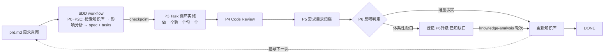

## 引言

AI 编程工具已经从「单代码块补全」进化成能自主接管多文件、跨模块任务的 Coding Agent。但同一套工具用在不同项目上，体验像两个物种：原型项目里 vibe coding 很爽，一句话一个模块；换到一个沉淀了多年业务的复杂系统，产出就开始「看起来能跑、实际埋雷」。

问题不在模型，在工程。模型不缺智能，缺的是两样它参数里根本没有的东西：你这个项目的业务知识，和你团队实际的开发流程。

这篇文章复盘我在一个复杂后端系统里引入 agent CLI 之后走过的路：

> 裸 prompt → 结构化 prompt → 知识库 → workflow + SDD → skill 化 → 裁剪回流与 skill 群

所有结构与机制都来自真实实践，项目信息已全部脱敏。

---

## 一、背景：复杂业务系统为什么对 AI 不友好

实践载体是一个多模块后端系统：一条异步任务管线（接口提交 → 队列 → 异步执行 → 回调通知）做核心骨架，上面挂着多条业务线，另有跨域子系统和全局策略。具体业务不重要，重要的是它代表的那类系统的共性：演进多年，大量关键知识不在代码表面。

这类系统对 AI 编程助手有两处天然的不友好：

1. **业务知识不在代码表面**。一个接口改动可能牵动队列常量、枚举值、回调协议一连串约定，散落在多个模块里，靠读代码现场推演，成本极高。
2. **开发动作是多阶段链路**。需求澄清 → 影响分析 → 方案 → 实施 → 验证 → review → 归档，缺任何一环，都可能产出「看起来能跑、实际埋雷」的代码。

后面的历程分四个阶段，外加一次回流。

---

## 二、阶段一：从裸 prompt 到结构化 prompt

一开始就是直接跟 agent 说自然语言：「修复 xx 问题」「开发 xx 功能」，剩下交给 agentic loop 和工具内置流程。

问题很快暴露出来：AI 对业务上下文的理解靠现场读代码拼凑，经常抓错重点、漏掉关联影响；产出质量波动大；需求很少一次完成，我得不停纠正。

第一次改进是调整 prompt 本身，更结构化、更规范化，背景 / 目标 / 约束 / 验收分块写，指望以此激活 LLM 内置的领域知识，让它按领域专家的方式思考。

有效，但两个根子上的问题还在：

1. 仍然很难一次性完成需求。纠正成本只是从「每步都错」降到「关键处仍错」。
2. 过程信息无法沉淀。每次新会话，项目背景、技术栈约定、开发流程都要重新输入一遍，prompt 写得再好，也是一次性消耗品。

到这一步我看明白了：prompt 工程优化的是单次输入的质量，可真正稀缺的是可复用的业务知识和稳定的开发流程。这两样都得放到会话之外去。

---

## 三、阶段二：知识库建设——把业务知识写成资产

只靠 agent 现场从代码里发现业务，效率低、准确性差，每开一个会话还要重复劳动。于是动手建项目知识库，目标很简单：让 AI 先读知识，再看代码。

### 3.1 组织思想：DDD 分层

概念上把项目知识分成业务、代码资产、约束、架构四个维度；落到目录时改用 DDD 的组织方式，分三级：业务域 → 域下业务线 → 跨域业务。

| 层次    | 内容                                  |
| ----- | ----------------------------------- |
| 全局架构  | 系统总览、模块依赖、枚举/常量/配置项速查资料            |
| 核心主线  | 系统围绕运转的主业务完整链路                      |
| 域下业务线 | 各业务线的提交流程、处理逻辑、数据模型、下游集成           |
| 跨域业务  | 跨业务线复用的子系统与全局策略                      |
| 过程资产  | 开发约定（版本管理、提交规范）；SDD 产物归档            |

需求进来先归域，再定位到具体的业务线文档。业务域枚举同时也是影响分析的索引。

### 3.2 结构思想：索引 + 渐进式披露

知识库按索引加**渐进式披露**（progressive disclosure）组织，避免一次性把全部内容灌进上下文：

```
根 INDEX.md（全局导航 + 快速入口 + 写作规范 + 已知缺口）
    └── 子目录 INDEX.md（本地导航）
            └── 叶子文档（具体知识）
```

配套的写作规范：每个目录必须有 `INDEX.md`；内部链接用相对路径；源码引用用项目根绝对路径；涉及时效的内容标注分析日期；一篇一主题，超过 300 行考虑拆分；推断的内容显式标出来。

### 3.3 效果与边界

效果是 AI 接需求后按「根索引定方向 → 子索引找文档 → 叶子文档读细节」的路径检索，影响范围分析的准确率和速度都明显提升。顺带的好处是知识库同样服务人，新人上手成本降了一截。

但边界也清楚：知识库管的是 AI 知道什么，不管 AI 怎么做。开发流程仍然靠 agent 的内置行为。

---

## 四、阶段三：workflow + SDD——把开发经验固化为流程

### 4.1 agent 的内置流程不够用

agent 的内置流程是通用的，不长着我们的开发经验：不做影响范围分析就直接动手，不确认方案就开始实施，改完不 review，也不回写知识库。结果和阶段一一样，不断纠正。

于是把实际做需求时的那套动作提炼成 workflow，写进 `AGENTS.md`，让 agent 默认按它执行。`AGENTS.md` 同时承载知识库的使用方式和业务开发约束，比如接口规范、常量复用、统一消息体这些。

### 4.2 第一堂课：Spec 职责膨胀，以及行业给的答案

流程跑起来后，瓶颈挪到了产物上：spec 把「实现目标」和「实现步骤」混在一起写。需求一大，文档膨胀、逻辑混杂，agent 照着巨型 spec 一次性全量生成代码，出错率和调试成本都高。

当时找到的行业答案是 **SDD（Spec-Driven Development）**：把「做什么 / 约束什么（契约）」与「具体怎么做（执行）」严格分开。典型形态是三件套：

```
PRD (业务意图: What & Why)
 └── [拆解]
      ├── spec.md    技术与架构契约：模型变动、API、数据契约（严禁包含实现步骤）
      ├── DESIGN.md  视觉契约：设计 Token、组件形态、样式红线（仅含 UI 的项目）
      └── tasks.md   原子化任务清单：带依赖关系的 CheckList，单任务限制在 1~3 个文件
```

这套答案很有价值，但它是一份通用模板。移植时要回答的问题不是照抄哪些文件，而是我的项目到底需要哪些机制。

### 4.3 裁剪之后：当时实际运行的 spec 形态

几轮试错，第一版落地成了单一 spec 文档、八段结构，workflow 每执行一次生成一份：§0 Workflow 配置 / §1 需求描述 / §2 影响分析 / §3 实施方案 / §4 验收标准 / §5 实施记录 / §6 Code Review / §7 总结。

裁掉三件套，理由有三条：

1. DESIGN.md 没有使用场景，这是个纯后端系统。但「用机器可读的清单锁死红线」这个思路保留了，落在 review 的维度清单上。
2. 实现步骤留在 §3，不拆独立的 tasks.md。契约和步骤分节就够，拆成两个文件反而多出一份同步负担。
3. spec 还担了一个提案里没提到的职责：流程状态的唯一持久化载体。这个职责从哪来的，见下一节。

### 4.4 第二堂课：流程不可观测、不可回溯

workflow 进了 `AGENTS.md`，agent 确实按流程走了，但新的麻烦跟着来：

- 不可观测：agent 走到哪一步了，每一步的输入输出是什么，对话流里看不清；
- 不可回溯：一周后回头看某次改动，当时的需求理解、方案取舍、踩过的坑全丢了，只剩代码。

对应的办法是把 workflow 建模成**状态机**：`P0 项目上下文解析 → P1A 需求采集 → P1B 影响分析 → P2A 环境采集 → P2B 约定与开发模式 → P2C 编写 spec → P3 实施 → P4 review → P5 归档 → P6 知识库反哺 → DONE`，spec 文档就是状态机的持久化状态。几个关键机制：

- **Checkpoint**：P2C → P3 边界强制暂停。实施是不可逆操作，必须由开发者显式说「继续」。
- **回退规则**：一次只能回退一个 phase，保留上游产出，回退原因写入实施记录。
- **打断规则**：内置打断（比如在主干分支上直接动手时中断，要求先建分支），加外部打断（需求变更触发重置，可暂停、可恢复）。
- **转移通知**：每次状态转移输出一份统一格式的交接单：已完成什么、现在在哪、下一步做什么、需要开发者做什么。
- **会话恢复**：会话中断后，读 spec 里的 checkpoint 快照就能恢复 workflow 位置，不依赖对话记忆。
- **防死循环**：所有循环有界（追问 ≤3 轮、修订 ≤3 轮），每轮必须收敛，超限熔断上报。

### 4.5 运行数据

那段时间一个月里沉淀了 23 份 spec，覆盖 feat / fix / refactor 三类需求，其中既有知识库建设本身，也有 workflow 自己的演进，流程工具在迭代它自己。附带的好处落在「踩坑记录」这一节：像「全文档 grep 验收时宽正则会误匹配同名文件，得用精确模式」这种细节，写进去一次，就不会踩第二次。

---

## 五、阶段四：skill 化——让流程离开项目、可携带

### 5.1 动机

workflow 在 `AGENTS.md` 里跑了一阵，暴露两个问题：

1. **流程定义与项目耦合**。状态机、转移规则是通用内容，却和项目专属约束混在一起，没法复用到别的项目。
2. **常驻加载成本**。流程规格与日俱增，单文档一度 800+ 行，随项目入口文件每次会话常驻上下文，而绝大多数日常小改动根本用不上。

所以把 workflow 内化成 **skill**（`.agents/skills/sdd-workflow/`），改成显式触发，一句「按 SDD 流程」或「走 sdd」才启用。日常小改动不再背着流程跑。

### 5.2 skill 的结构：常驻规格 + 按需加载

OpenAI 和 Anthropic 在 Agent Skills 开放标准里给的几条原则，和这个设计正好对上：把 skill 当成写给「高智商但缺系统上下文的初级程序员」的 API 文档（ACI）；内容分层、按需加载（渐进式披露）；把频繁连用的多步操作合并成一个高层工作流，而不是堆一堆原子能力（少即是多）。落地结构：

| 路径            | 用途                                                        |
| ------------- | --------------------------------------------------------- |
| `SKILL.md`    | 常驻执行规格：配置 Schema、状态机定义、全局约束、Phase 加载地图                        |
| `references/` | 各 Phase 的五元组定义（输入/输出/执行逻辑/调试信息/终止条件），进入哪个 phase 才加载哪个文件        |
| `assets/`     | spec / tasks / 项目上下文清单模板                                   |
| `tools/`      | workflow 运行期工具（如 Grilling 追问规则）                            |

### 5.3 扩展点：隐藏文件承载项目适配

skill 是通用的，项目却各有各的特点。扩展点放在项目根目录的 `.sdd-workflow/project-context.md`，按块声明适配信息：知识库位置（根路径/索引/约定目录）、产物存储（需求目录容器/需求索引/归档根）、业务域枚举、横切关注点 checklist、Review 维度、反哺判定标准。

P0 阶段加载这份清单，没声明的项退回 skill 内置的通用默认值，比如「跨服务调用、数据库变更、API 契约变更、配置变更、新增枚举常量、异步任务、定时任务」这七项通用横切检查。通用流程在 skill 里，项目特性在隐藏文件里。

### 5.4 同期改进：追问的纪律

需求采集阶段加了两条规矩，把无依据提问和低效多轮交互砍掉了大半：

- **知识检索阶梯**：先查知识库，再查代码，最后才问人。可查证的事实禁止提问。
- **Grilling 追问**：每轮最多 3 题，只问决策与业务语义、不问事实，每题附推荐答案，3 轮熔断进「开放问题」。

---

## 六、回流：tasks.md 为什么又回来了

照上面的讲法，故事到这儿该收尾了：三件套裁成了单 spec。可流程又跑了一两个月，tasks.md 回来了。这次不是照搬提案，它的职责变了，变化是被真实痛点逼出来的。

P3 需要一个独立的进度载体。会话恢复只能恢复到 phase 粒度，P3 跑到一半断掉时，Task 勾选散在「实施记录」里，既撑大 spec 又没法直读。现在的 tasks.md 只装执行进度：每个 Task 是一个可独立验证的行为变更，通常不超过 3 个文件；Task 顺序即依赖顺序；每项声明局部验证方式（静态检查 / 模块编译 / 单测 / 场景复现）；fix 类需求必须带一个「场景复现」Task，验证原问题不再触发。做一个、勾一个、填一行结果；中断后读勾选状态，就是恢复点。spec.md 则退回状态锚点的位置：需求、契约、验收、记录、Review、总结。

「契约不写执行」这条规矩，最终是在文档内部兑现的。§3 改名「技术契约」：只回答做什么、约束什么，不出现可执行代码块，最多签名级伪代码。再加一张契约覆盖对照表，每条验收标准（有 PRD 时对应 AC 编号）必须映射到契约条目，没覆盖的写明裁剪理由。当初裁剪丢掉的「目标与步骤分离」，以章节纪律的方式找回来了。

DESIGN.md 没有以每需求必产物的形态回来，它变成了一个项目级可选配置：视觉契约文档的路径，含 UI 的项目才声明，不声明就全链路静默跳过；涉及 UI 的需求在契约里引用条款，不复制全文。

验证也从靠自觉变成了配置契约。构建命令、测试命令进了流程配置，全部 Task 勾选后跑全量编译加验收实测，作为 P3 的收尾门禁；项目没有测试基础设施，就退成静态检查并在实施记录里注明。命令执行另有 `auto / confirm` 两种模式，confirm 模式下每条命令执行前先中断展示，开发者确认才跑。

回头看，裁掉是对的：当时 tasks.md 没有独立职责，拆文件纯属增加同步负担。收回来也是对的：它现在只装进度，不装契约。判据从头到尾只有一个，形态是不是服务当下的痛点。

---

## 七、从一个 skill 到一个群

流程本身稳定之后，同一套状态机范式被复制到其他重复性的活动上。现在是四个 skill，边界互相咬合：

| Skill                     | 状态机   | 职责                                                            |
| ------------------------- | ----- | ------------------------------------------------------------- |
| `write-sdd-prd`           | D0–D4 | 知识库驱动的 PRD 编写：知识准备 → Grilling 采集 → 起草（checkpoint）→ 归档；区分需求型与接口文档型，模板按项目架构模式自动适配降级 |
| `sdd-knowledge-base-init` | K1–K4 | 从 0 到 1 建知识库：扫描 → 结构提案（只有地图，不含正文）→ checkpoint 确认 → 分批落地            |
| `sdd-knowledge-analysis`  | A0–A5 | 已有知识库的从 1 到 N：差距分析（缺失/过时/错误三类）→ 计划确认 → 取证写作 → 索引登记与自检 → 轮次报告      |
| `sdd-workflow`            | P0–P6 | 需求交付主流程                                                        |

四台状态机共享同一套做法：显式触发、checkpoint 强制确认、转移通知、有界循环加熔断、知识检索阶梯、产物落盘可恢复。两个衔接的地方值得单说：

- 知识库初始化坚持概览先行。K2 只给目录树提案、业务域清单和批次计划，每篇文档就一句话用途，开发者确认后按批次逐域落地。知识库自己也是渐进披露着长起来的。约定和代码模板必须从现有代码里提炼、附源码实例引用，并经开发者认可才能落库，AI 不能单方面发明规范。
- 反哺开始有账本。P6 管「这次改了什么」的增量更新；一口气吃不下的大块缺口（某个域整体太浅、文档系统性过时）先登记到根索引的「已知缺口」，标 `[P6升级]`，之后由 `sdd-knowledge-analysis` 轮次消化，消除后回填来源需求的总结章节。另一个衔接：知识库初始化跑完，会自动基于已确认的事实生成一份 `.sdd-workflow/project-context.md` 草案，不用人再填一遍。

产物组织也跟着从「一份 spec」变成「一个需求目录」：每个需求一个目录，日期加描述命名，可带需求号后缀；`prd.md / spec.md / tasks.md` 放在同一目录，相对链接随归档整目录移动不断裂；需求索引每需求登记一行（状态/产物/备注）；终态目录按 `<年>/<月>/` 整目录归档；旧的扁平产物区只读，不迁移。

---

## 八、当前全貌



- 知识库是地基。P0 解析、P1B 影响分析、P6 反哺都直接依赖它，现在它连自己的初始化和分析工具都有了。
- skill 群是引擎。通用流程加通用范式，靠隐藏清单扩展点适配项目。
- 需求目录是账本。每次流程执行的完整留痕，可观测、可回溯、可恢复。

---

## 九、计划核对：承诺的事落了哪些

阶段三复盘时列过四项后续计划，现在对一下账：

1. **经验内化闭环：已落地**。Code Review 问题表加了「来源类型」字段，规范类问题（编码风格、约定、可模板化的）被显式标成 P6 知识内化的输入。知识库一侧配套了落点判定：事实知识（系统是什么）进业务域、速查、架构文档；规范知识（代码怎么写）进 conventions/templates，并且必须附现有代码实例。知识库的口子从「描述系统」扩到了「规定写法」。
2. **代码模板模块：已落地**。初始化 skill 里有高频模式提炼规则：从现有代码扫描命名习惯、典型构造、异常与日志风格，逐条附源码引用，确认后落库。
3. **专职 Code Review SubAgent：未落地**。spec 模板的 review 章节预留了执行者字段（委托独立 review agent 优先、自审必须声明），但对抗式校验还没建立起来。这仍是当前最大的视角盲区。
4. **语言级 LSP：未落地**。影响分析还是知识库加文本检索，跨文件调用链有漏判风险。

---

## 十、几点体会

1. **演进的本质是三次剥离**：把业务知识从对话里剥离出来（知识库），把开发流程从个人经验里剥离出来（workflow / SDD），把项目特性从通用流程里剥离出来（skill + 清单扩展点）。每剥一次，一类经验就从会话消耗品变成可复用资产。
2. 知识库是一切的地基。没有它，影响分析只能靠 AI 现场猜；没有反哺，它会在代码演进里腐烂。开发和沉淀必须同频。
3. 可观测性不是锦上添花。spec 留痕最初只是为了解决「不知道 agent 干了什么」，后来发现最大的用处是流程可以中断恢复、经验可以事后复盘。
4. 裁剪方法论不算亵渎方法论。三件套被裁成单 spec，又收回来两件套，两次都对，因为判据一直是当下的痛点，不是蓝图的原文。
5. 开发者的角色在变。从敲命令、盯输出，变成维护知识资产和流程资产：知识库写一次、流程定一次，收益摊到之后每一次需求上。
