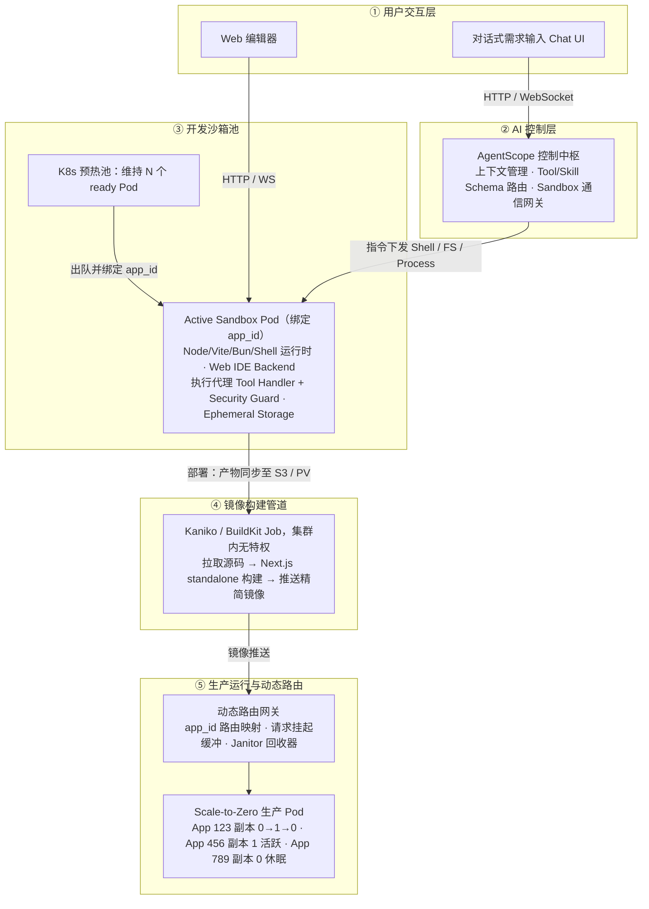
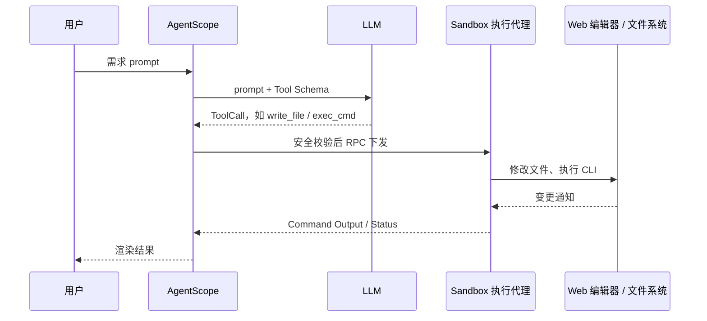
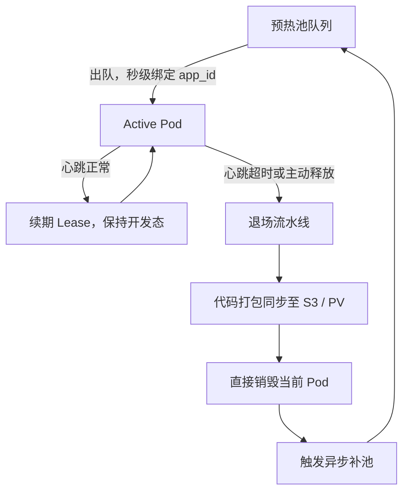
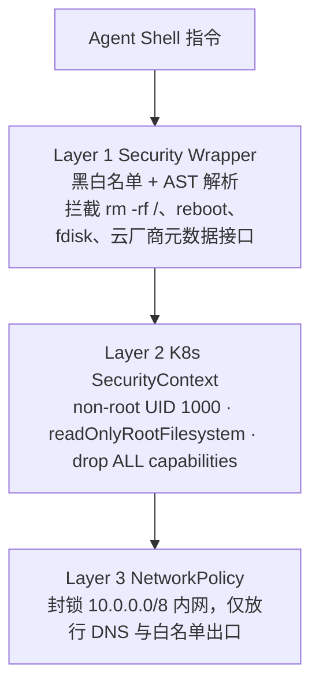
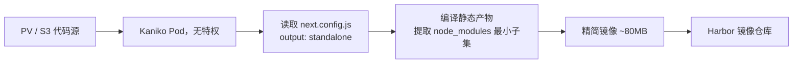
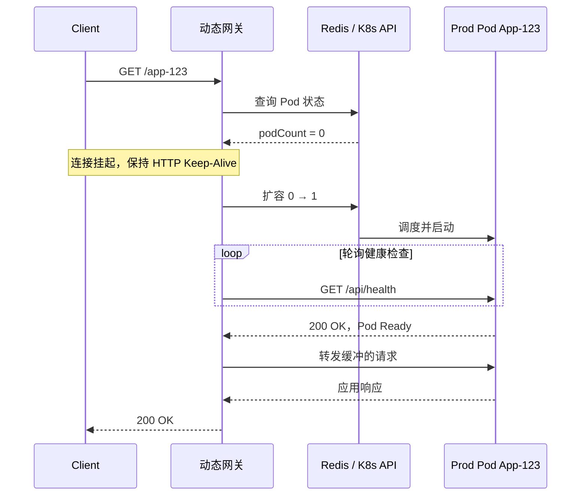

## 引言

这类平台的形态大致是：用户不再打开本地 IDE，而是在浏览器里用自然语言描述需求，agent 在云端沙箱里建目录、装依赖、改代码、跑 dev server，用户通过 Web 编辑器看结果；确认之后一键部署，产物变成一个平时不占资源、有请求才醒过来的线上应用。

难点集中在两端。开发端要求沙箱秒级可用，用户等不了容器冷启动、依赖安装和 PV 挂载这一整套；生产端要求零常驻成本，agent 生成的应用数量会远超人工开发，但其中绝大多数只有作者自己会访问，每个都常驻一个 Pod 的话，集群很快被空转进程吃满。

下面分整体架构、开发态、部署态、演进方向四部分，设计里的取舍和已知风险一并写出来。

---

## 一、整体架构

平台由 AgentScope、K8s、Docker、Kaniko 和动态网关组合而成，按职责分五层。



用户交互层有两个入口，对话窗口负责表达需求，Web 编辑器负责看代码和手动改。编辑器不是独立服务，它由沙箱 Pod 自己暴露，这一点决定了沙箱镜像里必须常驻一个 IDE backend 进程。

AI 控制层是 AgentScope 中枢，做三件事：管理上下文窗口和会话历史，按 schema 把 LLM 输出路由到具体 tool，再通过 gRPC 或 REST 把指令下发到沙箱。

沙箱池是一组预热好的 Pod，开发期间用户代码只存在于 Pod 本地。构建管道负责把这份代码变成生产镜像。最下面的动态网关承担 app_id 到 Pod 的路由、冷启动时的请求缓冲，以及空闲 Pod 的回收。

### 1.1 agent 与沙箱之间的调用时序

开发态下，AgentScope 通过标准 tool 协议驱动沙箱内的执行代理完成写文件、改代码、跑命令：



值得注意的是安全校验的位置。指令级过滤放在控制层，沙箱侧的执行代理在真正落地前再兜一次底。只在一处过滤不够：控制层的规则更新有延迟，而沙箱是唯一真正执行命令的地方。

---

## 二、开发态

### 2.1 沙箱池化与生命周期

静态 PV 预挂载这条路走不通。每个用户一个 PV、Pod 启动时挂上，问题有两个：PV 挂载是 Pod 启动路径上的同步操作，冷启动时间不可控；ReadWriteOnce 的 PV 一旦挂到某个 Pod，就无法再被池里的另一个 Pod 挂载，复用直接冲突。

改成预热池加临时盘，持久化推迟到退场那一刻：



池子维持 N 个 ready Pod，N 按历史并发峰值配。分配一个沙箱只有两个动作：改 Pod label，在控制层内存里写入 app_id 到 Pod IP 的绑定。不碰存储、不重启进程，目标是把分配耗时压到 100ms 以内。

开发期间的读写全部落在容器本地的临时盘上。高频小文件场景，比如 node_modules 和 Vite 的 HMR 缓存，可以直接用 memory-backed emptyDir，省掉分布式文件系统的 I/O 锁开销。

退场是唯一一次持久化。用户断开或心跳超时（10 分钟）后，后台把临时盘打包上传 S3 或 MinIO，然后直接销毁 Pod。不在原 Pod 里做清理，因为残留的 dev server、僵尸进程和被 agent 改坏的环境变量，重来一次比修干净便宜。

这套设计最大的风险是：Pod 存活期间，用户的工作副本只有一份，就在容器本地。节点驱逐、OOM kill 或者上传失败，未同步的改动就没了。必须配一个兜底，在沙箱里跑定时增量同步，比如每 60 秒把 worktree 的 diff 推到对象存储，把丢失窗口从整个会话缩到最近一分钟。

### 2.2 基础镜像分层与依赖预热

分层的目的是把耗时操作全部前移到构建期。

```dockerfile
# Base Layer: 操作系统与编译工具链
FROM node:20-alpine AS base-runtime
RUN apk add --no-cache git bash curl python3 make g++ \
    && corepack enable \
    && corepack prepare pnpm@9.15.0 --activate

# Layer 1: Web IDE backend 及其依赖
FROM base-runtime AS editor-baked
WORKDIR /opt/ide
COPY ./vendor/web-editor-backend ./
RUN pnpm install --frozen-lockfile

# Layer 2: 脚手架模板与离线依赖 store
FROM editor-baked AS template-baked
WORKDIR /opt/templates
COPY ./templates/vite-react ./vite-react
COPY ./templates/nextjs-app ./nextjs-app
# 预跑安装，生成包含全量 cache 的镜像内 store
RUN cd ./vite-react && pnpm install --store-dir /root/.local/share/pnpm/store/v3
RUN cd ./nextjs-app && pnpm install --store-dir /root/.local/share/pnpm/store/v3

# Final Layer: 预热池运行镜像
FROM template-baked AS runner
EXPOSE 8080 3000
CMD ["/opt/ide/start.sh"]
```

base-runtime 里的 python3、make、g++ 是给 node-gyp 用的，不少包在 alpine 上要现场编译。editor-baked 把 IDE backend 装进镜像，沙箱起来就能提供编辑器。template-baked 预置 Vite、Next.js 等常用脚手架，并且预先跑一遍安装，把包塞进镜像内的 pnpm store。

agent 在沙箱里装依赖时，控制层的 tool 会强制给命令加上离线参数：

```bash
pnpm add <package> --prefer-offline --store-dir=/root/.local/share/pnpm/store/v3
```

命中预置 store 的包直接从本地硬链接，不走公网。这里有个副作用：`--prefer-offline` 只在 store 里存在对应版本时才生效，用户装了一个预置之外的版本，请求照样穿透到 registry。所以后面 NetworkPolicy 的白名单必须放行 npm 源，不能真的把出口全关死。

### 2.3 agent 执行的安全边界

AgentScope 要在沙箱里跑大模型生成的任意 shell 命令，这是整个平台风险最高的地方。三层拦截：



指令安全包装器用黑白名单加 AST 解析做过滤，禁止 `reboot`、`fdisk`、`curl http://169.254.169.254` 这类访问云厂商元数据接口的动作。AST 解析比正则匹配难绕过，`r""m -rf /` 这种 shell 拼接能骗过正则，骗不过语法树。

容器级隔离靠 SecurityContext：

```yaml
# Pod / 容器 spec 片段
securityContext:
  runAsNonRoot: true
  runAsUser: 1000
  readOnlyRootFilesystem: true
  allowPrivilegeEscalation: false
  capabilities:
    drop: ["ALL"]
  seccompProfile:
    type: RuntimeDefault
```

`readOnlyRootFilesystem: true` 要配合 emptyDir 使用，给 `/workspace` 和 `/tmp` 挂上可写卷，否则 pnpm 和 dev server 都写不了东西。

网络出口隔离屏蔽集群内部的 Service 网段，只放行公网 npm 镜像源和指定 API。这一层防的是沙箱里的代码横向摸到控制面，K8s API、Redis、内部 registry 全在这个网段里。

三层是递进关系，不是冗余：包装器拦意图，SecurityContext 拦权限，NetworkPolicy 拦出口。前两层被绕过时，第三层保证攻击者拿到的仍然是一个无法外联、也访问不到内网的空壳。

---

## 三、部署态

### 3.1 集群内构建：Kaniko

部署触发后，控制面创建一个 K8s Job 跑构建。不在沙箱 Pod 里构建，也不依赖宿主机的 docker daemon。



用 Kaniko 而不是 docker-in-docker，是因为 dind 需要 privileged 容器，等于把节点交到用户代码手里。Kaniko 在普通 Pod 里解析 Dockerfile、逐层构建、直接推 registry，全程无特权。Next.js 侧配合 `output: 'standalone'`，产物自带最小 node_modules 子集，最终镜像能压到 80MB 左右。

```yaml
apiVersion: batch/v1
kind: Job
metadata:
  name: build-job-app-123
spec:
  template:
    spec:
      containers:
      - name: kaniko
        image: gcr.io/kaniko-project/executor:v1.20.0-debug
        args:
        - "--context=s3://app-code-bucket/app-123.tar.gz"
        - "--dockerfile=Dockerfile.prod"
        - "--destination=registry.internal/apps/app-123:v1.0.0"
        - "--cache=true"
        - "--cache-dir=/cache"
        volumeMounts:
        - name: kaniko-cache
          mountPath: /cache
      restartPolicy: Never
      volumes:
      - name: kaniko-cache
        persistentVolumeClaim:
          claimName: kaniko-cache-pvc
```

`--cache=true` 配一个共享 cache 卷，让同一应用的重复部署只重建变化的层。要注意这个 PVC 是 ReadWriteOnce，多个构建 Job 并发时会互相争抢。构建量上来之后，要么换成 ReadWriteMany 的存储，要么改用 `--cache-repo` 把层缓存推到远端 registry，让 Job 之间彻底无共享。

### 3.2 网关的请求缓冲

scale-to-zero 的代价是第一个请求要等 Pod 起来。网关的做法是把这段等待藏在连接里，而不是返回错误页让用户自己重试。



请求进来，网关按 path 解析出 app_id，查 Redis 拿副本数。副本数为 0 就触发扩容，同时挂住当前连接，轮询 Pod 的健康检查端点，就绪之后再把缓冲的请求转发过去。对客户端来说，这只是一次比较慢的响应。

```go
func (g *Gateway) HandleRequest(w http.ResponseWriter, r *http.Request) {
    appID := extractAppID(r.URL.Path)
    podIP, exists := g.lookupActivePod(appID)

    if !exists {
        // 1. 触发 K8s 扩容
        err := g.k8sClient.ScaleDeployment(appID, 1)
        if err != nil {
            http.Error(w, "Failed to scale app", http.StatusInternalServerError)
            return
        }

        // 2. 挂起当前连接，进入健康检查等待队列
        ctx, cancel := context.WithTimeout(r.Context(), 15*time.Second)
        defer cancel()

        readyPodIP, err := g.waitForPodReady(ctx, appID)
        if err != nil {
            http.Error(w, "Application Cold Start Timeout", http.StatusGatewayTimeout)
            return
        }
        podIP = readyPodIP
    }

    // 3. 转发请求
    g.proxyToPod(w, r, podIP)
}
```

15 秒超时是经验值：Node 应用从调度到 listen 通常 3~8 秒，留一倍余量。超时之后返回 504 而不是继续挂着，因为再等下去客户端自己也会超时，不如明确告诉用户失败了。

有个细节容易漏：挂起期间要限制并发唤醒。同一个冷应用的 100 个并发请求不该触发 100 次 `ScaleDeployment`，网关侧要按 app_id 做 singleflight，只有第一个请求负责唤醒，其余等同一个结果。

### 3.3 Janitor：阶梯式回收

回收同时看两个信号，应用空闲了多久，集群还剩多少资源。

```python
import time

class PodLifecycleJanitor:
    def __init__(self, k8s_client, metrics_client, redis_client):
        self.k8s = k8s_client
        self.metrics = metrics_client
        self.redis = redis_client

    def run_eviction_loop(self):
        while True:
            cluster_mem_percent = self.metrics.get_cluster_memory_usage()
            active_apps = self.k8s.get_running_serverless_apps()
            now = time.time()

            for app in active_apps:
                last_active = self.redis.get_last_access_timestamp(app.id)
                idle_time = now - last_active

                # 策略 1: 超长空闲强制回收（硬阈值 30 分钟）
                if idle_time > 1800:
                    self.k8s.scale_to_zero(app.id)
                    continue

                # 策略 2: 资源高压抢占式回收（软阈值 10 分钟 + 内存 > 85%）
                if cluster_mem_percent > 85.0 and idle_time > 600:
                    self.k8s.scale_to_zero(app.id)
                    # 回收一个就重新读一次水位
                    cluster_mem_percent = self.metrics.get_cluster_memory_usage()

            time.sleep(30)
```

两条策略：空闲超过 30 分钟无条件回收到 0；集群内存超过 85% 时把空闲阈值降到 10 分钟，回收一个再重读一次水位，够了就停。第二条是抢占式的，目的是在节点压力上来之前先腾地方，而不是等 kubelet 开始驱逐，那时候被赶走的可能是活跃应用的 Pod。

30 秒的巡检周期是在回收延迟和 API 压力之间取的折中。应用数量多的时候，每轮遍历要发 N 次 Redis 查询加若干次 metrics 查询，这个循环本身会变成负载。规模上来之后应该改成事件驱动，网关在处理最后一次请求时写一个延迟任务，而不是靠轮询全量扫描。

---

## 四、演进方向

现在的状态是：冷启动 1~3 秒，租户隔离靠容器，运行时是标准 Node Pod。三个演进方向分别针对这三点。

### 4.1 CRIU：把初始化状态存成快照

思路是沙箱 Pod 跑完初始化（框架加载、模块解析、端口 listen）之后，用 CRIU 把进程树的内存状态 dump 到 S3；新连接进来时不重启进程，直接 restore。理论上能把 1~3 秒的冷启动压到 100ms 以内，因为跳过的正是最耗时的那一段。

实际约束不少。CRIU 需要内核开启 `CONFIG_CHECKPOINT_RESTORE`；dump 出来的状态要跟目标节点的内核和 glibc 版本对得上，跨节点漂移因此受限；Node 进程持有的 socket、epoll fd、timer 在 restore 之后都要重建，dev server 的监听端口和已建立的 WebSocket 尤其麻烦。比较务实的路径是先拿生产侧的 Next.js standalone 进程试，它的 fd 状态比沙箱里的 dev server 简单得多。

### 4.2 Firecracker：换成独立内核

容器隔离的本质是共享宿主机内核，一个内核提权漏洞就能穿透到节点和其他租户。Firecracker 用 KVM 给每个沙箱一个独立内核，启动开销约 125ms，比传统虚拟机低两个数量级。在"允许 agent 执行任意 shell"这个前提下，这是比 SecurityContext 强得多的保证。

前提是节点要有 `/dev/kvm`。GKE、EKS 的标准节点池不暴露嵌套虚拟化，得单开裸金属节点池，成本模型会变。工程上一般不直接对接 Firecracker API，而是走 Kata Containers，让它以 RuntimeClass 的形式接进现有调度体系。另外 rootfs 和网络要从 OCI 镜像模型换成 virtio 模型，Kaniko 的产物需要一个转换层。

### 4.3 Wasm：把一类应用从 Pod 里拿出来

没有原生依赖、逻辑简单的 API 和 SSR 应用，构建期多产一个 Wasm target，运行时直接丢进网关侧的 WasmEdge，连 Pod 都不用起。冷启动是微秒级，常驻成本接近零。

适用范围窄是它主要的问题。`node:fs`、`child_process`、原生 addon 在 Wasm 运行时里覆盖不全，任何用了数据库驱动的二进制、sharp、esbuild 原生版本的项目都跑不了。可行的做法是在构建期做能力探测，依赖图里没有原生模块才走 Wasm 通道，否则回落到现在的 Pod 方案。两条通道会长期并存。

---

## 五、几点取舍

整套架构的核心矛盾是：agent 生成的应用会很多，但几乎没有流量。所有设计都在围绕这一点做平衡。沙箱侧用预热池把成本前置到"随时可用"，生产侧用 scale-to-zero 把成本后置到"有人访问"，中间靠 Kaniko 和动态网关把两侧接起来。

真正的风险不在冷启动那几秒，而在两处：临时盘方案下用户工作副本的单点问题，以及让大模型执行任意 shell 命令这件事本身。前者靠增量同步兜底，后者靠三层边界，长期看要换到 MicroVM。冷启动慢一点用户会抱怨，工作副本丢了或者沙箱被穿透，用户会直接走。
