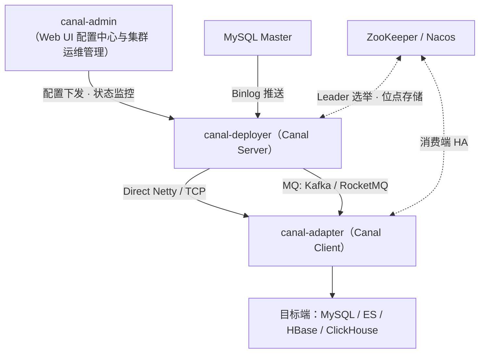
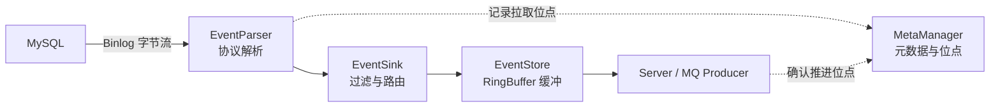
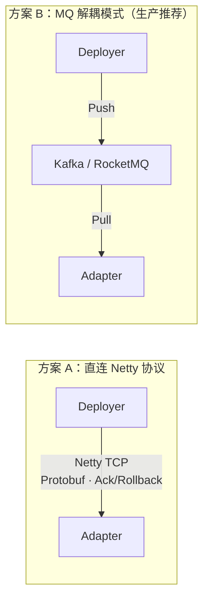
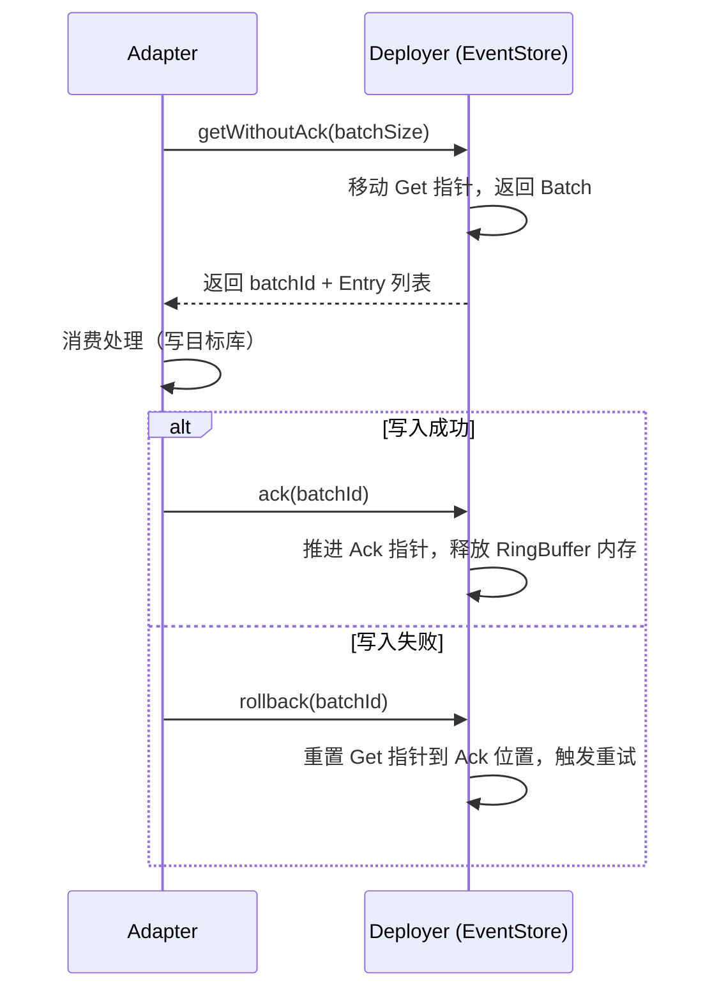
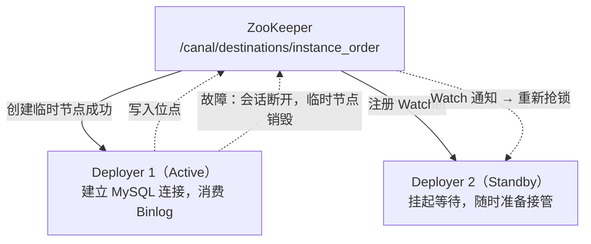
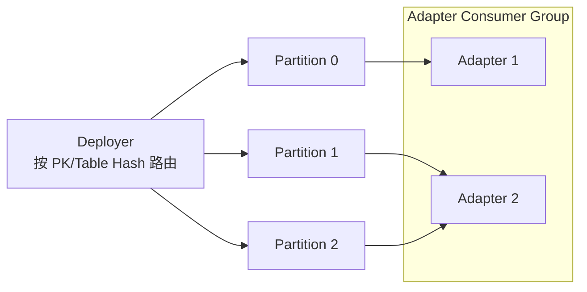

## 引言

Canal 是阿里开源的基于 MySQL 增量日志（Binlog）解析的订阅与消费组件。它的核心原理一句话可以说完：**伪装成 MySQL 的 Slave 节点**，向 Master 发送 `COM_BINLOG_DUMP` 指令；Master 把它当成一个正常从库，开始推送 Binlog，Canal 再将二进制日志解析为结构化数据供下游消费。

这个「欺骗」之所以可行，是因为 MySQL 的主从复制协议本身就是一个公开的、基于 Socket 的注册-推送协议：Slave 连上 Master，表明身份，报出自己要从哪个文件哪个位点开始拉，剩下的事 Master 会主动做。Canal 只需要在协议层面做到与真实 Slave 兼容，就能以极低的侵入性拿到数据库的全部变更流——不需要业务改造，不需要触发器，不依赖 XA。

理解 Canal 的关键在于两条线：**一条是数据线**（Binlog 字节流如何变成下游可消费的结构化事件），**一条是控制线**（位点如何记录、消费如何确认、节点故障后如何接管）。下面从整体架构、Deployer 内部链路、Deployer/Adapter 协同方式及分布式 HA 机制四个层面逐条拆解。

---

## 一、整体架构与核心组件划分

Canal 生态由四个部分组成，各组件职责边界非常清晰：

1. **canal-admin**：轻量级 Web 管理界面，用于集群配置统一下发、实例（destination）生命周期管理和状态监控。没有 admin 时 Canal 也能跑，只是配置散落在各节点的本地文件里；有 admin 之后，实例的启停、参数变更都在页面上完成。
2. **canal-deployer（Canal Server）**：核心服务进程。负责与 MySQL 连接、拉取 Binlog、解析数据、内存缓冲，以及对外提供 TCP 传输服务或推送到 MQ。所有的「重活」都在这一层。
3. **canal-adapter（Canal Client 适配器）**：官方提供的一体化消费端。负责订阅 Deployer 或 MQ 的数据变更事件，通过配置映射（ETL 规则），将数据同步写入目标端（如 MySQL 分表、Elasticsearch、HBase、ClickHouse 等）。不想自己写消费代码的同步场景，用它。
4. **ZooKeeper / Nacos**：协调层。用于 Deployer 的高可用 Leader 选举、实例路由元信息存储，以及消费位点（Position）管理。

这里有一个容易混淆的概念：**destination（Instance）**。一个 Deployer 进程可以承载多个 Instance，每个 Instance 对应一个独立的数据库订阅任务，拥有自己独立的解析管道和位点。HA 选举的粒度也是 Instance 级而非进程级——这意味着同一台机器可以「A 任务当 Active、B 任务当 Standby」，多节点之间天然形成交叉主备，避免全部流量压到单台机器上。

---

## 二、Deployer 内部数据处理链路

每个 Instance 内部是一条完整的数据处理管道（Pipeline），四个核心模块串成一条链：

### 1. EventParser：协议解析层

这一层做三件事：

- **伪装 Slave**：模拟 MySQL Replication 协议，与 Master 建立 Socket 连接并发送 Dump 请求。支持基于位点（`mysql-bin.000003:4`）和基于 GTID 两种注册方式。
- **网络解析**：接收原始 Binlog 字节流，利用 `canal.parse` 模块解析为 MySQL 事件对象（QUERY / TABLE_MAP / WRITE_ROWS / UPDATE_ROWS / DELETE_ROWS 等）。
- **过滤与转化**：将事件过滤并转码为 Canal 定义的 `Entry` 标准数据结构——基于 Protobuf 序列化，包含 Header（库名、表名、事件类型、执行时间、位点）和 StoreValue（行数据）。

其中容易被忽略的一步是 **row 事件到列名的映射**：row-based Binlog 里只有列的值没有列的名字，TABLE_MAP 事件只带 table_id。Canal 必须在本地缓存表结构（table meta），把 table_id 翻译成 schema + 列名，下游才能拿到「带字段名的行」。这也是为什么表结构变更（DDL）过程中要特别关注 Canal 的位点漂移和 meta 刷新。

### 2. EventSink：数据过滤与路由层

- **正则过滤**：根据配置的 `canal.instance.filter.regex` 进行表名/库名过滤，把不关心的库表在进缓冲前就丢弃，节省内存和网络。
- **归并与路由**：在多 Master 或分库分表汇聚场景下，将多个 Parser 产出的数据进行时间戳归并或路由排序，保证下游看到的变更顺序合理。
- **数据加工**：支持自定义拦截器（`CanalEventDownStreamHandler`）对 Entry 做额外补充或加解密。

### 3. EventStore：内存缓冲队列层

这是整个管道里设计密度最高的模块。`MemoryEventStoreWithBuffer` 基于类似 LMAX Disruptor 的环形队列实现，内部维护三个指针：

| 指针 | 语义 | 推进方 |
| --- | --- | --- |
| `Put` | Parser 写入位点 | EventParser（生产） |
| `Get` | Client/MQ 读取位点 | 下游拉取/发送 |
| `Ack` | Client/MQ 消费确认位点 | 下游确认 |

三个指针把 RingBuffer 切成三段：`[Ack, Get)` 是已取出未确认的在途批次，`[Get, Put)` 是已写入未被读取的存量，`[Put, Ack+BufferSize)` 是可写的空闲区。

**环形覆盖控制**：当 `Put - Ack >= BufferSize` 时写入阻塞——注意阻塞的判定基于 Ack 而不是 Get。这意味着下游「取而不确认」同样会制造背压，Canal 用这个机制在内存占用和有界可靠之间取得平衡：要么下游正常消费释放空间，要么上游 Parser 停下来等，绝不静默丢数据。代价是下游长期不确认会让 RingBuffer 满、反压传导到 Binlog 拉取端。配合 MySQL 侧的 `binlog_expire_logs_seconds`（老版本为 `expire_logs_days`）还要盯紧：解析停滞太久、位点落后超过 Binlog 保留窗口，Master 把日志清了就再也追不回来了。

### 4. MetaManager：元数据与位点管理

实时记录当前消费的 Binlog 文件名、Position 位点以及 GTID 信息，是断点续传的账本。支持多种存储介质：

- `Memory`：内存，进程重启即丢失，仅限开发调试；
- `File`：本地文件，单机部署够用；
- `ZooKeeper`：分布式协同，**生产环境推荐**——它同时是 HA 切换时新主恢复现场的依据。

位点的持久化时机值得留意：Canal 是按 store 已确认（Ack）的进度刷位点，而不是按 Parser 已拉取的位置。这决定了整体语义是**至少一次**——故障切换后从最后确认位点重放，可能重复，不会漏。

---

## 三、Deployer 与 Adapter 的通信与协同

Deployer 解析出的数据怎么交给下游？官方支持两种主流架构：

### 1. 方案 A：直接 TCP 协议通信（Netty）

没有中间件的场景下，Adapter 充当 Canal TCP Client 直接连 Deployer。通信协议基于 Netty 传输 Protobuf 序列化的数据包，核心是一套 **Get / Ack / Rollback** 的拉取确认机制：

两个细节决定行为：

- **`getWithoutAck` 而非 `get`**：自动 Ack 模式下数据一旦发出位点就前进，下游处理失败即丢失；生产上必须用无确认拉取 + 显式 Ack，把释放内存的权利交给真正完成落盘的环节。
- **Rollback 的粒度**：`rollback(batchId)` 将 Get 指针重置回 Ack 位置。如果中间有多个已拉取未确认的批次，会一并回退重发，所以下游必须按主键做幂等（upsert），不能假设「一条数据只到达一次」。

### 2. 方案 B：基于 MQ 异步解耦（Kafka/RocketMQ）

Deployer 开启 MQ 模式后自身充当 Producer，将解析好的 JSON 或 Protobuf 格式 Binlog 消息直接发送到 MQ Topic；Adapter（或任何自研消费者）作为 MQ Consumer 消费。

两种方案的取舍对比：

| 评估维度 | 直连 TCP 模式（方案 A） | MQ 解耦模式（方案 B，推荐） |
| --- | --- | --- |
| **耦合度** | 高（Adapter 宕机可能导致 Deployer 内存积压） | 低（MQ 承担削峰填谷与持久化缓冲） |
| **扩展性** | 较弱，不支持多 Consumer 并发消费同一队列 | 极强，支持 MQ 分区（Partition）并发消费 |
| **运维复杂度** | 低（无需维护 MQ） | 中等（需运维 Kafka/RocketMQ） |
| **适用场景** | 单机/小规模数据同步、轻量级迁移 | 大规模高并发、多下游系统订阅、分库分表 |

本质区别在于**缓冲层的容量与持久性**：方案 A 的缓冲是 Deployer 进程内的 RingBuffer——内存有限、重启即空，下游停滞的背压会一路顶到 Binlog 拉取端；方案 B 把缓冲外包给 MQ 的磁盘日志，容量近乎无限，且天然支持一份变更流被多个下游订阅组各自独立消费。代价是 Deployer 到 MQ 这一跳变成了 Push，发送失败时 Canal 的重试/降级策略需要显式配置（如 `canal.mq.lazyRetry`），否则可能丢消息。

另外一个必须关注的点是 **MQ 模式下的顺序性**：Kafka 只保证分区内有序。Canal 按指定 Key（`canal.mq.dynamicKey` / 分区 hash 策略，如按 PK 或表名）把消息路由到不同 Partition——只要路由键保证「同一行/同一表的变更恒定落同一分区」，行级顺序就有保障；如果按轮询分发，更新可能被乱序消费，目标端出现脏数据。

### 3. Adapter 内部的 ETL 映射与落盘

Adapter 收到数据后，通过 YAML 规则文件（`rdb` / `es` / `hbase` 等 outerAdapter 配置）完成映射：

- **结构解析**：将 Protobuf/JSON 转换为扁平化的 DTO 结构（`Dml` 对象：database、table、type、columns）。
- **SQL 拼接 / API 调用**：
  - 目标是 RDB：根据 `insert` / `update` / `delete` 三种处理器策略，自动拼接为 `INSERT ... ON DUPLICATE KEY UPDATE` 或 `DELETE` 等 SQL，通过连接池批量执行。目标表必须有主键，否则 update/delete 无法定位行。
  - 目标是 ES：将记录转为 JSON Document，调用 Bulk API 写入索引，用 PK 或自定义文档 id 保证幂等。

也就是说 Adapter 的落盘同样依赖「目标端幂等 + Canal 至少一次」这对组合，重复消息在 upsert 语义下被自然吸收。

---

## 四、分布式部署与高可用（HA）机制

### 1. Deployer 的分布式 HA：Instance 级主备选举

先澄清一个高频误解：Canal Deployer 的分布式**不是指单个 Instance 的并行切片解析**。因为单个 MySQL 实例的 Binlog 是一个全局有序的日志流，任何下游要的都是一条不断链的顺序流，必须单线程串行解析——把 Binlog 切给多个节点并行解析，意味着要在下游重新归并定序，复杂度和风险都失控。

所以 Canal 的分布式指的是：**基于 ZooKeeper 的 Instance 级别 Leader 选举与故障自动转移（Active-Standby）**。

流程拆开看：

1. **抢锁**：多台 `canal-deployer` 节点配置同一个 `destination`（如 `instance_order`），启动后尝试在 ZK 的 `/canal/destinations/instance_order/running` 路径下创建**临时节点**。ZK 保证同名节点只有一个能创建成功。
2. **Active**：抢锁成功者建立与 MySQL 的连接，开启 Binlog 消费链路，并持续把位点写入 ZK。
3. **Standby**：抢锁失败者对该节点注册 Watcher，处于热备挂起状态，不连 MySQL。
4. **Failover**：Active 节点宕机或与 ZK 会话超时，临时节点随之销毁；Standby 收到 Watch 变更后重新抢锁，新 Active 从 ZK 读取 `MetaManager` 记录的最后位点，从那一点接替 Binlog 解析。

临时节点（Ephemeral Node）+ Watch 这一对原语是整个方案的支点：会话生命周期即锁生命周期，不需要额外的心跳表或租约协议；故障检测（Session Timeout）和恢复通知（Watch）都在 ZK 内部闭环。代价也来自同一处——网络抖动导致 Active 与 ZK 会话超时但 MySQL 连接未断时，可能出现极短的双主窗口，依赖「同一 destination 在 MySQL 侧表现为两个 Slave 连接 + 位点覆盖」的幂等性兜底，这也是消费端坚持至少一次语义的原因之一。

多 Instance 时还有第三种角色：既非 Active 也非 Standby 的**分配等待**状态。当 admin/ZK 以分配模式（`canal.deployer.getInstanceTimeOut` / 任务均摊策略）管理时，destination 会被静态指派到指定机器，其余节点不参与该任务的选举。

### 2. Adapter 的分布式与伸缩

消费端的扩展取决于上面选的协同方案：

- **直连 TCP 模式下的 Adapter HA**：多个 Adapter 节点同样通过 ZK 做 Client 端的抢占式高可用——任一时刻只有一个 Adapter 在消费 Deployer，宕机后由 Standby 接管。仍然是单点消费，HA 解决可用性，不解决吞吐。
- **MQ 模式下的分布式伸缩（高并发推荐）**：Deployer 将 Binlog 按指定 Key（如 `PK` 或表名）Hash 路由到 Topic 的不同 Partition；集群部署多个 `canal-adapter` 节点组成同一个 **Consumer Group**，利用 MQ 的 Rebalance 机制实现多节点并行消费与分区容错，落盘吞吐随节点数近线性扩展。

---

## 五、小结

把四条线收拢成一张清单：

| 关注点 | 机制 | 位置 |
| --- | --- | --- |
| 数据怎么来 | 伪装 Slave，`COM_BINLOG_DUMP` 推送 | EventParser |
| 数据怎么流 | Parser → Sink → Store → Server/MQ 四段管道 | Instance Pipeline |
| 背压怎么控 | RingBuffer 三指针，`Put - Ack >= BufferSize` 阻塞 | EventStore |
| 消费可靠吗 | Get/Ack/Rollback，至少一次，下游须幂等 | TCP 协议 / MQ offset |
| 现场怎么恢复 | MetaManager 位点持久化到 ZK | MetaManager |
| 节点挂了怎么办 | ZK 临时节点抢锁 + Watch，Instance 级 Active-Standby | 分布式 HA |

几个可以直接落地的结论：

1. **位点存哪儿决定敢不敢上生产**：`File` 位点 + 单机 Deployer 只能接受重启手工核对；生产标配是 ZK 位点 + 至少一个 Standby 节点。
2. **下游稳定性决定通信方案**：Adapter 偶发失败、吞吐波动大、有多个订阅方——上 MQ；一次性轻量迁移——直连 TCP 更省事。
3. **幂等是消费端的义务**：无论 Ack/Rollback 回退重发还是切换重放，Canal 保证的是不漏不序（至少一次），去重要靠目标端的 upsert / 主键覆盖。
4. **监控盯两个指标**：`Put - Ack`（缓冲水位，反映消费停滞）和位点延迟（反映与 MySQL 的差距，对比 `binlog_expire_logs_seconds` 评估追不上被清日志的风险）。

Canal 的架构没有引入任何独创性很强的分布式协议——Master 授权、环形缓冲、租约选举，每一样都是成熟模式的复用。它的价值恰恰在于把这些模式组合在一个正确的抽象上：把「数据库变更」当作一条带位点的有序日志流来对待，于是复制、缓冲、确认、恢复这些难题都落到了已有答案的地方。
